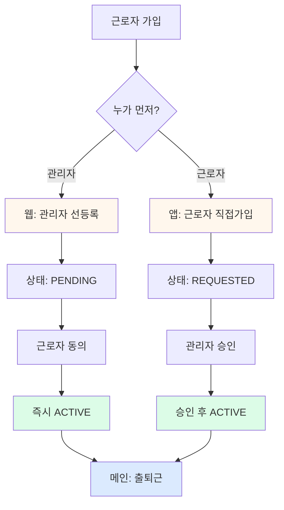

# 통패스 근로자 가입 FAQ

> **핵심만 빠르게 이해하기**

---

## Q1. 근로자 계정은 어디에 저장되나요?

**A1. 항상 "회사 > 현장 > 팀" 안에 저장됩니다.**

```
회사 (삼성건설)
└── 현장 (대전공장)
    └── 팀 ((주)정이앤지)
        └── 근로자 (홍길동) ← 여기에만 존재
```

- "회사 밖"에 별도 계정은 없습니다.
- 모든 근로자는 반드시 특정 회사/현장/팀에 소속되어야 합니다.

---

## Q2. 웹 초대와 앱 가입이 충돌하지 않나요?

**A2. 충돌하지 않습니다. 같은 테이블에 저장되며, 상태값으로 구분됩니다.**

| 방식 | 시작 상태 | 최종 상태 | 승인 필요 |
|------|----------|----------|:--------:|
| **웹 초대** (관리자 선등록) | `PENDING` | `ACTIVE` | X |
| **앱 가입** (근로자 직접가입) | `REQUESTED` | `ACTIVE` | O |

- 휴대폰 번호는 UNIQUE → 중복 가입 불가
- 먼저 등록된 쪽의 플로우를 따릅니다.

---

## Q3. 관리자가 먼저 등록하면 근로자는 뭘 하나요?

**A3. 동의만 하면 즉시 활성화됩니다. (프리패스)**

```
관리자(웹) → 근로자 정보 입력 → [등록] → PENDING 상태
                                        ↓
근로자(앱) → 휴대폰 인증 → 약관 동의 → 전자서명 → 즉시 ACTIVE ✅
```

- 관리자가 이미 신원 확인했으므로 승인 불필요
- 근로자는 "동의"만 하면 바로 사용 가능

---

## Q4. 근로자가 직접 가입하면?

**A4. 관리자 승인을 기다려야 합니다.**

```
근로자(앱) → 회사코드 입력 → 휴대폰 인증 → 정보 입력 → 약관 동의 → REQUESTED 상태
                                                            ↓
                                                    승인 대기 화면 ⏳
                                                            ↓
관리자(웹) → 승인 대기 목록 확인 → [승인] 버튼 클릭 → ACTIVE ✅
```

- 관리자가 누군지 모르므로 확인 필요
- 승인 전까지 앱에서 "대기 화면"에 머뭄

---

## Q5. 동일 번호로 두 방식을 동시에 시도하면?

**A5. 먼저 등록된 쪽이 우선입니다.**

### 시나리오 1: 관리자가 먼저 등록 (웹)
```
1. 관리자: 010-1234-5678 → PENDING 등록 ✅
2. 근로자: 010-1234-5678로 앱 가입 시도
   → "관리자가 이미 등록했습니다. 동의 절차를 진행해주세요." 안내
   → 자동으로 동의 플로우로 전환
```

### 시나리오 2: 근로자가 먼저 가입 (앱)
```
1. 근로자: 010-1234-5678 → REQUESTED 등록 ✅
2. 관리자: 같은 번호로 웹에서 등록 시도
   → "이미 가입 신청한 근로자입니다." 에러
   → 웹에서 승인 대기 목록으로 안내
```

---

## Q6. 관리자가 등록한 정보와 근로자 입력이 다르면?

**A6. 충돌 플래그를 기록하고 관리자에게 알립니다.**

```typescript
// 앱: 이름이 다른 경우
관리자 등록: "홍길동"
근로자 입력: "홍길남"
            ↓
팝업: "관리자 등록 정보와 다릅니다. 입력한 정보로 가입하시겠습니까?"
            ↓
[확인] → is_data_conflict: true 플래그 전송
            ↓
관리자 웹: "정보 불일치" 배지 표시 → 수동 확인
```

---

## Q7. 입력 항목이 다른가요?

**A7. 대부분 동일하지만, 시스템 권한만 다릅니다.**

| 항목 | 웹 (관리자) | 앱 (근로자) |
|------|:-----------:|:-----------:|
| 소속 팀 | O | O |
| 이름 | O | O |
| 휴대폰 | O | O (SMS 인증) |
| 생년월일 | O | O |
| 직책/직종 | O | O |
| 성별 | O | O |
| 국적 | O | O |
| **시스템 권한** | **TEAM_ADMIN 선택 가능** | **WORKER 고정** |
| 이메일 | - | 선택 입력 |

**핵심 차이:**
- 웹: 관리자가 "팀 관리자" 권한 부여 가능
- 앱: 보안상 일반 "근로자" 권한만 부여

---

## Q8. 승인 전 근로자는 뭘 할 수 있나요?

**A8. 승인 대기 화면에서 벗어날 수 없습니다.**

```
┌─────────────────────────────┐
│ 가입 요청이 완료되었습니다   │
│                             │
│ 관리자 승인 후 이용 가능합니다│
│                             │
│   [상태 새로고침] 버튼       │
└─────────────────────────────┘

- 뒤로가기 불가 (Blocking)
- 출퇴근 기능 사용 불가
- 새로고침 버튼으로 상태 확인
```

- 승인되면 자동으로 메인 화면 전환
- 반려되면 반려 사유 팝업 표시

---

## Q9. 실시간으로 승인 알림이 오나요?

**A9. 네, Supabase Realtime으로 즉시 알림됩니다.**

```typescript
// 앱: WebSocket 구독
관리자가 [승인] 버튼 클릭
    ↓
users 테이블 UPDATE: status = 'ACTIVE'
    ↓
Realtime 이벤트 발생
    ↓
앱 자동 감지 → 메인 화면 전환 ✅
```

- 새로고침 버튼 없이도 자동 전환 가능
- 네트워크 끊김 시 수동 새로고침 필요

---

## Q10. 어떤 방식을 선택해야 하나요?

| 상황 | 추천 방식 | 이유 |
|------|----------|------|
| 근로자 명단을 미리 받은 경우 | **웹 초대** | 빠른 활성화 (프리패스) |
| 현장에서 즉석 가입 | **앱 가입** | 근로자가 직접 입력 |
| 고령자/앱 사용 어려움 | **웹 초대** | 관리자가 대신 등록 |
| 신원 미확인 근로자 | **앱 가입** | 관리자 승인으로 검증 |

**권장 조합:**
- 정규직/계약직 → 웹 초대 (사전 서류 검토)
- 일용직/임시직 → 앱 가입 (현장 즉시 가입)

---

## 요약: 한눈에 보기



---

## 관련 문서

- 📄 [상세 분석 문서](/docs/signin/근로자_가입_방식_명확화_문서.md)
- 📄 [가입 PRD](/docs/signin/통패스_근로자앱_가입_PRD.md)
- 📄 [데이터베이스 설계](/docs/DATABASE.md)
- 📄 [프로젝트 개요](/CLAUDE.md)

---

**작성일:** 2026-01-16
**버전:** v1.0
