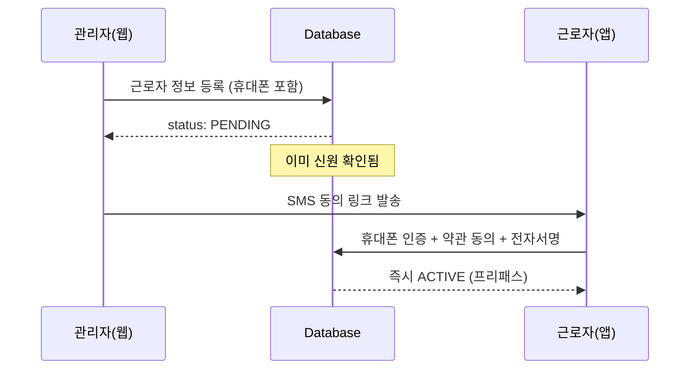
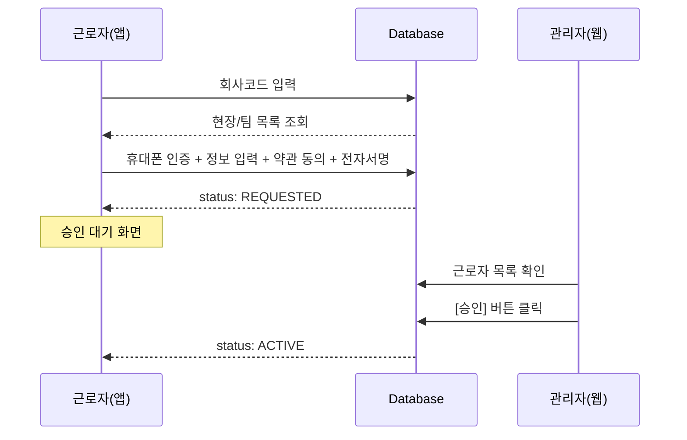
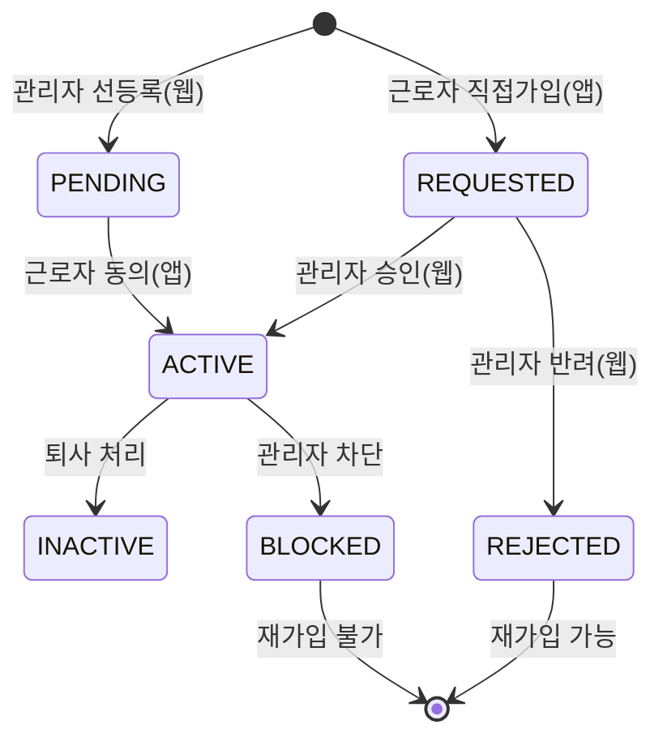

# 통패스 근로자 가입 방식 명확화 문서

> **작성일:** 2026-01-16
> **작성자:** PM
> **목적:** 웹 선등록 방식과 앱 직접가입 방식의 관계, 계정 소속 구조, 충돌 시나리오를 명확히 정리

---

## 1. 핵심 질문에 대한 답변

### Q1. 근로자 계정은 "바깥"과 "회사 안" 두 곳에 있어야 하는가?

**A1. 아니요. 근로자 계정은 항상 "회사 안"에만 존재합니다.**

```
회사 (Company)
└── 현장 (Site)
    └── 팀 (Team)
        └── 근로자 (Worker) ← 여기에만 존재
```

- 근로자는 **반드시 특정 회사, 현장, 팀에 소속**되어야 합니다.
- "회사 밖" 개념은 존재하지 않습니다.
- 다만, 가입 방식에 따라 **누가 먼저 등록하는가**가 다릅니다.

---

### Q2. 웹 초대 방식과 앱 회사코드 가입이 어떻게 연결되는가?

**A2. 두 방식은 동일한 테이블(`users`)에 기록되지만, 상태 전이 경로가 다릅니다.**

| 구분 | 방식 A (선등록) | 방식 B (직접가입) |
|------|----------------|------------------|
| **누가 먼저** | 관리자가 웹에서 등록 | 근로자가 앱에서 등록 |
| **초기 상태** | `PENDING` (동의대기) | `REQUESTED` (승인대기) |
| **최종 상태** | 근로자 동의 → 즉시 `ACTIVE` | 관리자 승인 → `ACTIVE` |
| **승인 필요** | 없음 (프리패스) | 있음 (관리자 확인) |

---

## 2. 가입 방식 상세 비교

### 방식 A: 관리자 선등록 (웹 → 앱)

**플로우:**


**특징:**
- 관리자가 사전에 신원 확인 완료 (서류 검토 등)
- 근로자는 **동의만 하면 바로 활성화**
- 승인 대기 불필요 → UX 우수
- 웹에서 등록 시 시스템 권한(`TEAM_ADMIN` vs `WORKER`) 선택 가능

**데이터베이스 상태:**
```sql
-- 관리자가 웹에서 등록 시
INSERT INTO users (
  company_id, site_id, partner_id,
  phone, name, birth_date, gender, nationality, job_title,
  role, status
) VALUES (
  1, 10, 100,
  '01012345678', '홍길동', '1990-01-01', 'M', 'KR', '전기기사',
  'WORKER', 'PENDING'
);

-- 근로자가 앱에서 동의 완료 시
UPDATE users
SET status = 'ACTIVE', approved_at = NOW()
WHERE phone = '01012345678' AND status = 'PENDING';
```

---

### 방식 B: 근로자 직접가입 (앱 → 웹)

**플로우:**


**특징:**
- 관리자가 **누군지 모르는 사람이 가입 요청**
- 반드시 **관리자 승인 필요** (신원 확인 목적)
- 앱에서 가입 시 시스템 권한은 항상 `WORKER` 고정 (보안)
- 승인 전까지 앱에서 "대기 화면"에 머물러야 함

**데이터베이스 상태:**
```sql
-- 근로자가 앱에서 가입 요청 시
INSERT INTO users (
  company_id, site_id, partner_id,
  phone, name, birth_date, gender, nationality, job_title,
  role, status, requested_at
) VALUES (
  1, 10, 100,
  '01087654321', '김철수', '1985-03-15', 'M', 'KR', '안전관리자',
  'WORKER', 'REQUESTED', NOW()
);

-- 관리자가 웹에서 승인 시
UPDATE users
SET status = 'ACTIVE', approved_at = NOW(), approved_by = :admin_user_id
WHERE id = :worker_id AND status = 'REQUESTED';
```

---

## 3. 데이터베이스 구조 (단일 테이블)

### users 테이블 (핵심 필드)

```sql
CREATE TABLE users (
  id UUID PRIMARY KEY,

  -- 소속 정보 (필수)
  company_id BIGINT NOT NULL,        -- 회사 ID
  site_id BIGINT NOT NULL,           -- 현장 ID
  partner_id BIGINT NOT NULL,        -- 팀(업체) ID

  -- 신원 정보
  phone VARCHAR(20) UNIQUE NOT NULL, -- 전화번호 (ID 역할)
  name VARCHAR(50) NOT NULL,
  birth_date DATE NOT NULL,
  gender VARCHAR(1),                 -- 'M' or 'F'
  nationality VARCHAR(10),           -- 국적 코드
  job_title VARCHAR(50),             -- 직책/직종

  -- 시스템 권한
  role user_role NOT NULL,           -- WORKER / TEAM_ADMIN

  -- 가입 상태
  status worker_status NOT NULL,     -- PENDING / REQUESTED / ACTIVE / ...

  -- 가입 메타 데이터
  requested_at TIMESTAMPTZ,          -- 방식 B: 가입 요청 시각
  approved_at TIMESTAMPTZ,           -- 승인/활성화 시각
  approved_by UUID,                  -- 승인 관리자 ID

  is_active BOOLEAN DEFAULT TRUE,
  created_at TIMESTAMPTZ DEFAULT NOW(),
  updated_at TIMESTAMPTZ DEFAULT NOW()
);
```

**중요:**
- 방식 A든 B든 **같은 테이블**에 저장됩니다.
- 회사/현장/팀 소속은 **언제나 필수**입니다.
- `status` 필드로 현재 가입 단계를 추적합니다.

---

## 4. 상태 전이 다이어그램



| 상태 | 의미 | 발생 경로 | 다음 액션 |
|------|------|----------|-----------|
| `PENDING` | 동의대기 | 관리자가 웹에서 선등록 | 근로자가 앱에서 동의 |
| `REQUESTED` | 승인대기 | 근로자가 앱에서 직접가입 | 관리자가 웹에서 승인/반려 |
| `ACTIVE` | 정상 | 최종 활성화 | 일반 사용 |
| `REJECTED` | 반려 | 관리자 반려 | 동일 번호로 재가입 가능 |
| `INACTIVE` | 비활성 | 퇴사 처리 | 재활성화 가능 |
| `BLOCKED` | 차단 | 관리자 차단 | 재가입 불가 |

---

## 5. 충돌 시나리오 및 해결 방안

### 시나리오 1: 동일 전화번호로 두 방식 동시 시도

**문제:**
- 관리자가 웹에서 `010-1234-5678`을 `PENDING`으로 등록
- 동시에 근로자가 앱에서 같은 번호로 가입 시도

**해결:**
```sql
-- users.phone에 UNIQUE 제약조건 존재
-- 먼저 INSERT된 쪽이 성공, 나중 시도는 에러 발생
CONSTRAINT users_phone_unique UNIQUE (phone)
```

**처리 방안:**
1. 앱에서 가입 시도 시 `phone` 중복 에러 감지
2. 기존 데이터의 `status` 확인:
   - `PENDING`이면 → "관리자가 이미 등록했습니다. 동의 절차를 진행해주세요."
   - `REQUESTED`이면 → "이미 가입 신청 중입니다."
3. 자동으로 해당 상태의 플로우로 유도

---

### 시나리오 2: 선등록 데이터와 근로자 입력값 불일치

**문제:**
- 관리자가 이름을 "홍길동"으로 등록
- 근로자가 앱에서 동의 시 "홍길남"으로 수정 시도

**해결:**
```typescript
// WorkerInfoScreen.tsx (앱)
const checkDataConflict = (): boolean => {
  if (!preRegisteredData) return false;

  if (preRegisteredData.name !== name.trim()) return true;
  if (preRegisteredData.birthDate !== birthDate) return true;
  // ... 기타 주요 필드 비교

  return false;
};

// 충돌 감지 시
if (hasConflict) {
  Alert.alert(
    '정보 확인',
    '관리자 등록 정보와 다릅니다.\n입력한 정보로 가입하시겠습니까?',
    [
      { text: '취소', style: 'cancel' },
      { text: '확인', onPress: () => submitWithConflictFlag(true) }
    ]
  );
}
```

**처리 방안:**
1. 충돌 시 `is_data_conflict: true` 플래그 전송
2. 관리자 웹에서 해당 근로자에 "정보 불일치" 배지 표시
3. 관리자가 수동으로 확인 후 조치

---

### 시나리오 3: 선등록 후 근로자가 회사코드로 재가입 시도

**문제:**
- 관리자가 `PENDING` 상태로 등록
- 근로자가 동의 링크를 못 받고 회사코드로 직접 가입 시도

**해결:**
```typescript
// PhoneVerifyScreen.tsx (앱)
const response = await verifySms(phoneNumber, code);

if (response.isRegistered) {
  if (response.status === 'PENDING') {
    // 선등록 데이터 있음 → 자동으로 동의 플로우로 전환
    navigation.navigate('WorkerInfo', {
      preRegisteredData: response.preRegisteredData,
      mode: 'CONSENT' // 동의 모드
    });
  } else if (response.status === 'ACTIVE') {
    // 이미 활성화됨 → 자동 로그인
    await login(response.accessToken);
  }
}
```

**처리 방안:**
1. SMS 인증 시 `phone`으로 기존 데이터 조회
2. `status`에 따라 자동으로 적절한 플로우로 분기
3. 사용자에게 "이미 등록된 계정입니다" 안내

---

## 6. 웹-앱 코드 연결 포인트

### 6.1 웹: 관리자 선등록 (admin-web)

**파일:** `/apps/admin-web/src/api/workers.ts`

```typescript
export async function createWorker(worker: UserInsert) {
  const { data, error } = await supabase
    .from('users')
    .insert({
      ...worker,
      status: 'PENDING', // 동의 대기 상태로 생성
    })
    .select()
    .single();

  if (error) throw error;
  return data;
}
```

**특징:**
- 초기 상태를 `PENDING`으로 설정
- SMS 발송은 별도 프로세스 (현재 미구현)

---

### 6.2 앱: 근로자 직접가입 (TongPassApp)

**파일:** `/apps/TongPassApp/src/screens/auth/WorkerInfoScreen.tsx`

```typescript
const navigateToTerms = (isDataConflict: boolean) => {
  navigation.navigate('Terms', {
    registrationData: {
      companyId, siteId, phoneNumber, teamId,
      name, birthDate, gender, email, nationality, jobTitle,
      isDataConflict, // 데이터 충돌 플래그
    },
  });
};
```

**특징:**
- 입력 데이터 수집 후 약관 동의 → 전자서명 → 최종 등록
- 등록 시 상태는 `REQUESTED` (승인 대기)

---

### 6.3 공통: 가입 API

**파일:** `/backend/supabase/functions/v1/register-worker` (예정)

```typescript
// Edge Function 예시 (Deno)
const registerWorker = async (req: Request) => {
  const body = await req.json();
  const { phoneNumber, preRegistered } = body;

  // 기존 데이터 확인
  const existing = await getByPhone(phoneNumber);

  if (existing && existing.status === 'PENDING') {
    // 선등록 데이터 있음 → 동의 처리
    await updateStatus(existing.id, 'ACTIVE');
    return { status: 'ACTIVE', workerId: existing.id };
  } else if (existing) {
    // 이미 가입된 번호
    return { error: 'ALREADY_REGISTERED' };
  }

  // 신규 가입
  const worker = await createUser({
    ...body,
    status: 'REQUESTED', // 승인 대기
    role: 'WORKER',       // 앱 가입은 WORKER 고정
  });

  return { status: 'REQUESTED', workerId: worker.id };
};
```

---

## 7. 입력 항목 통일

두 방식 모두 **동일한 필수 항목**을 수집합니다.

| 항목 | 필수 | 방식 A (웹) | 방식 B (앱) |
|------|:----:|:-----------:|:-----------:|
| 소속 팀 | O | 드롭다운 선택 | 드롭다운 선택 |
| 이름 | O | 텍스트 입력 | 텍스트 입력 |
| 휴대폰 | O | 텍스트 입력 | SMS 인증 |
| 생년월일 | O | 8자리 입력 | 8자리 입력 |
| 직책/직종 | O | 선택+직접입력 | 선택+직접입력 |
| 성별 | O | 토글 | 라디오 |
| 국적 | O | 드롭다운 | 드롭다운 |
| 시스템 권한 | - | TEAM_ADMIN/WORKER 선택 | WORKER 고정 |
| 이메일 | X | - | 선택 입력 |

**핵심 차이점:**
- **시스템 권한**: 웹에서는 `TEAM_ADMIN` 부여 가능, 앱에서는 `WORKER` 고정
- **이메일**: 앱에서만 선택 입력 (추후 소셜 로그인 대비)

---

## 8. 실시간 연동 (Realtime)

### 웹 → 앱: 승인 알림

```typescript
// 앱: WaitingScreen.tsx
const channel = supabase
  .channel(`user-${userId}`)
  .on('postgres_changes', {
    event: 'UPDATE',
    schema: 'public',
    table: 'users',
    filter: `id=eq.${userId}`,
  }, (payload) => {
    if (payload.new.status === 'ACTIVE') {
      // 승인 완료 → 메인 화면으로 자동 전환
      navigation.replace('Main');
    } else if (payload.new.status === 'REJECTED') {
      // 반려 → 반려 사유 표시
      Alert.alert('가입 반려', payload.new.rejection_reason);
    }
  })
  .subscribe();
```

### 앱 → 웹: 신규 가입 요청

```typescript
// 웹: WorkersPage.tsx
const channel = supabase
  .channel(`users-${siteId}`)
  .on('postgres_changes', {
    event: 'INSERT',
    schema: 'public',
    table: 'users',
    filter: `site_id=eq.${siteId}`,
  }, (payload) => {
    if (payload.new.status === 'REQUESTED') {
      // 승인 대기 뱃지 갱신
      refetchWorkers();
    }
  })
  .subscribe();
```

---

## 9. 요약 및 결론

### 핵심 원칙

1. **단일 계정 구조**: 근로자는 항상 "회사 > 현장 > 팀" 안에 소속되며, 바깥에 별도 계정은 없습니다.
2. **두 가지 진입점**: 웹(관리자 선등록) vs 앱(근로자 직접가입)
3. **상태로 구분**: `PENDING` vs `REQUESTED`로 진입 경로를 추적
4. **동일 테이블**: 방식과 관계없이 `users` 테이블 하나로 관리
5. **충돌 방지**: `phone` UNIQUE 제약 + 중복 체크 로직

### 가입 방식 선택 가이드

| 상황 | 추천 방식 |
|------|----------|
| 관리자가 근로자 명단을 사전에 보유 (서류 검토 완료) | 방식 A (선등록) |
| 근로자가 현장에 와서 즉석 가입 | 방식 B (직접가입) |
| 고령자나 앱 사용이 어려운 근로자 | 방식 A (관리자 대행) |
| 빠른 온보딩이 필요한 경우 | 방식 A (프리패스) |
| 보안이 중요한 경우 (신원 미확인) | 방식 B (관리자 승인) |

### 다음 단계

- [ ] 웹: 선등록 UI 구현 (`/apps/admin-web/src/pages/workers/CreateWorkerPage.tsx`)
- [ ] 앱: SMS 인증 API 연동 (`/apps/TongPassApp/src/api/auth.ts`)
- [ ] 백엔드: `register-worker` Edge Function 구현
- [ ] 웹: 승인 대기 목록 및 승인/반려 버튼 구현
- [ ] 앱: Realtime 연동으로 실시간 승인 알림 구현

---

## 부록: 관련 파일 목록

### 문서
- `/docs/signin/통패스_근로자앱_가입_PRD.md` - 가입 플로우 상세 명세
- `/docs/DATABASE.md` - 데이터베이스 구조
- `/CLAUDE.md` - 프로젝트 전체 개요

### 코드: 웹 (admin-web)
- `/apps/admin-web/src/api/workers.ts` - 근로자 CRUD API
- `/apps/admin-web/src/pages/workers/WorkersPage.tsx` - 근로자 목록
- `/apps/admin-web/src/components/workers/WorkerForm.tsx` - 근로자 등록 폼 (예정)

### 코드: 앱 (TongPassApp)
- `/apps/TongPassApp/src/screens/auth/CompanyCodeScreen.tsx` - 회사코드 입력
- `/apps/TongPassApp/src/screens/auth/PhoneVerifyScreen.tsx` - SMS 인증
- `/apps/TongPassApp/src/screens/auth/WorkerInfoScreen.tsx` - 정보 입력
- `/apps/TongPassApp/src/screens/auth/WaitingScreen.tsx` - 승인 대기

### 데이터베이스
- `/backend/supabase/migrations/00010_worker_registration_fields.sql` - 가입 필드 추가 마이그레이션

### 공통 타입
- `/packages/shared/src/types/index.ts` - `WorkerStatus`, `UserRole` 정의

---

**문서 버전:** v1.0
**최종 수정:** 2026-01-16
